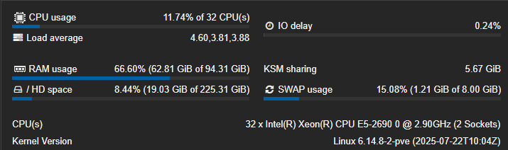
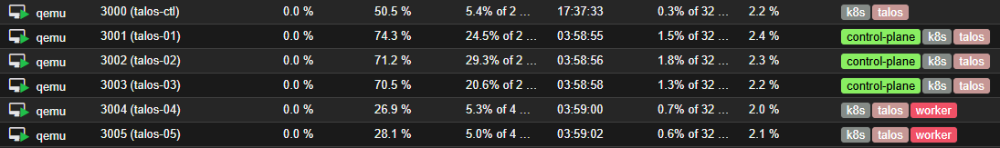
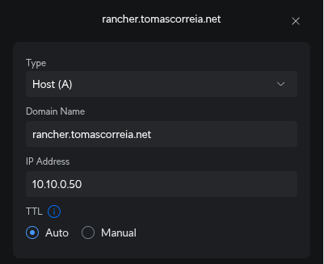
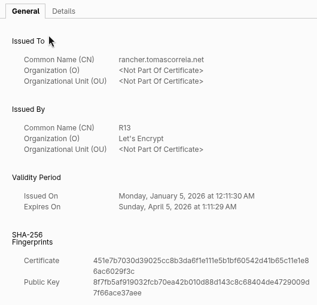

After much time wanting to get my hands on [Kubernetes](https://kubernetes.io/), I finally got around to setting it up on my homelab.

This blog post will cover the steps I took, the challenges I faced, and the solutions I found along the way and how finally got it all working and migrated some workloads to Kubernetes.

> **Note**
> ~~For the technical details, go to my separate documentation [here](https://www.perplexity.ai/).~~
> I ended up deleting my documentation website. The truth is that LLMs are so good, you can get by with them.

## Why?

I always had an interest in container orchestration and wanted to learn more about how to manage containerized applications effectively and how to use them.

Kubernetes is the leading platform in this space, and very valuable for anyone looking to work with containers at scale, by setting it up on my homelab, besides the headaches, I aim to gain practical experience and deepen my understanding of Kubernetes concepts.

## My current setup

I deploy a lot of applications in my homelab, ranging from bare metal servers, virtual machines on [Proxmox VE](https://www.proxmox.com/en/products/proxmox-virtual-environment/overview), and some [Docker](https://www.docker.com/) stacks.

My main virtualization host is an old HP Z620 Workstation, it is a somewhat powerful, power hungry machine, but it gets the job done and gives me a lot of flexibility to run different workloads.



## The search for the right Kubernetes flavor

The main objective is to learn a somewhat enterprise-grade Kubernetes setup that can handle production workloads while being mindful of the limited resources available in my homelab. I explored various Kubernetes distributions and tools to find the right fit for my needs.

After much consideration, I decided to go with [Talos](https://talos.dev/), a modern, somewhat lightweight Kubernetes (actual k8s) distribution. The main selling points for me were:

- **Simplicity**: Talos contains the bare minimum required to run Kubernetes, which makes it easy to understand and manage.
- **Predictability**: Talos follows a strict configuration model, which reduces surprises and hopefully I will not need to manage the VM's as much.
- **Security**: Talos is designed with security in mind, it has a really small attack surface and is immutable by default, which aligns well with my security goals.

## Setting up Talos

> **Warning**
> This is a high-level overview of the setup process.
> ~~For way more detailed instructions, please refer to my documentation [here](https://www.perplexity.ai/).~~

Since I have the resources available, and if it isn't obvious by now, I decided to go with a virtualized setup. After downloading the [Talos ISO image](https://factory.talos.dev/), I uploaded it to my Proxmox VE environment.

### Virtual Machines

I will create a **5** machine cluster, with **3** control plane nodes and **2** worker nodes. **Control plane** nodes are responsible for managing the cluster, while **worker** nodes run the actual applications.

Here are the specifications for each node:

| Node Type     | CPU Cores | RAM  | Disk Size | Number |
| ------------- | --------- | ---- | --------- | ------ |
| Control Plane | 2         | 4 GB | 40 GB     | 3      |
| Worker        | 4         | 8 GB | 120 GB    | 2      |

After setting up the virtual machines, they looked like this:



If you look closely, you can see an extra VM called **talos-ctl**, I created this to run the `talosctl`, the `kubectl` and the `helm`utilities without needing to install them on my local machine, it will also store the configuration files for the time being.

### IP Allocation

Here is the IP allocation for each node in the cluster, they are all in the same subnet so no need for complicated routing:

| Node Name | Node Type     | IP Address |
| --------- | ------------- | ---------- |
| talos-ctl | Utility VM    | 10.10.0.49 |
| talos-01  | Control Plane | 10.10.0.51 |
| talos-02  | Control Plane | 10.10.0.52 |
| talos-03  | Control Plane | 10.10.0.53 |
| talos-04  | Worker        | 10.10.0.54 |
| talos-05  | Worker        | 10.10.0.55 |

I reserved the IP addresses in my Unifi Network Controller to ensure they are always assigned to the correct VMs.

In addition to those IPs, I also reserved `10.10.0.50` for the control plane VIP, and a range in the `10.10.0.60's` for future use.

### The Talos cluster

Before creating our k8s environment, we need to configure the Talos cluster. This involves setting up the control plane and worker nodes, as well as configuring the networking and storage options.

This is actually a really simple process, after installing the [`talosctl`](https://www.talos.dev/v1.10/talos-guides/install/talosctl/) utility, we can generate the necessary secrets and configuration files.

1. **Generate the secrets**:

```
talosctl gen secrets -o secrets.yaml
```

This generated the `secrets.yaml` file, which contains the necessary secrets for the cluster, as I said before, Talos

2. **Generate the configuration files**:

```
talosctl gen config name-of-cluster https://10.10.0.50:6443 \
  --with-secrets secrets.yaml \
  --install-disk /dev/sda \
  --output ./clusterconfig
```

Point `talosctl` to the correct configuration directory:

```
export TALOSCONFIG=$PWD/clusterconfig/talosconfig
```

This generated the configuration files for the cluster in `./clusterconfig`.

Edit the `./clusterconfig/controlplane.yaml` file to set the correct VIP and the nic settings.

```yaml title="controlplane.yaml"
machine:
  network:
    interfaces:
      - interface: eth0
        dhcp: true
        vip:
          ip: 10.10.0.50
```

3. **Apply the configuration**:

Then, we can apply the configuration to each node:

```
# control planes (one by one)
talosctl apply-config --insecure -n 10.10.0.51 -f clusterconfig/controlplane.yaml
talosctl apply-config --insecure -n 10.10.0.52 -f clusterconfig/controlplane.yaml
talosctl apply-config --insecure -n 10.10.0.53 -f clusterconfig/controlplane.yaml

# workers
talosctl apply-config --insecure -n 10.10.0.54 -f clusterconfig/worker.yaml
talosctl apply-config --insecure -n 10.10.0.55 -f clusterconfig/worker.yaml
```

By now, your nodes should be installing and rebooting.

Setting up `talosctl` endpoints:

```
talosctl config endpoint 10.10.0.51 10.10.0.52 10.10.0.53
talosctl config nodes 10.10.0.51
```

4. **Bootstrapping the cluster**:

```
talosctl bootstrap -n 10.10.0.51
talos health
```

And boom! Your Talos cluster is up and running with k8s installed.

```
correia@talos-ctl:~/talos$ talosctl get members
NODE         NAMESPACE   TYPE     ID              VERSION   HOSTNAME        MACHINE TYPE   OS                ADDRESSES
10.10.0.51   cluster     Member   talos-9gj-92t   2         talos-9gj-92t   controlplane   Talos (v1.10.7)   ["10.10.0.50","10.10.0.51","2001:ipv6::11ff:fe02:3ff6"]
10.10.0.51   cluster     Member   talos-isd-h92   1         talos-isd-h92   worker         Talos (v1.10.7)   ["10.10.0.54","2001:ipv6::11ff:feaf:7ad8"]
10.10.0.51   cluster     Member   talos-jls-qix   1         talos-jls-qix   controlplane   Talos (v1.10.7)   ["10.10.0.53","2001:ipv6::11ff:fe1e:f8b0"]
10.10.0.51   cluster     Member   talos-l5m-ljy   1         talos-l5m-ljy   controlplane   Talos (v1.10.7)   ["10.10.0.52","2001:ipv6::11ff:fe26:46f0"]
10.10.0.51   cluster     Member   talos-v9n-17e   1         talos-v9n-17e   worker         Talos (v1.10.7)   ["10.10.0.55","2001:ipv6::11ff:fed2:fbec"]
```

### Accessing the Kubernetes cluster

Now that your Talos cluster is up and running with k8s installed, you can access the Kubernetes API server using `kubectl`. First, you need to configure `kubectl` to use the correct context.

1. **Get the kubeconfig file**:

```
talosctl kubeconfig -n 10.10.0.51 -f clusterconfig/kubeconfig --force
```

> **Note**
> This will place the kubeconfig file in `./clusterconfig/kubeconfig`.

2. **Set the KUBECONFIG environment variable**:

```
export KUBECONFIG=$PWD/clusterconfig/kubeconfig
```

3. **Verify the connection**:

```
correia@talos-ctl:~/talos$ kubectl get nodes
NAME            STATUS   ROLES           AGE     VERSION
talos-9gj-92t   Ready    control-plane   5h39m   v1.33.4
talos-isd-h92   Ready    worker          5h39m   v1.33.4
talos-jls-qix   Ready    control-plane   5h39m   v1.33.4
talos-l5m-ljy   Ready    control-plane   5h39m   v1.33.4
talos-v9n-17e   Ready    worker          5h38m   v1.33.4
```

> **Info**
> As you saw, I placed all configuration files in the `clusterconfig` directory, I like to keep things together.
>
> Since I moved them from the default location, I needed to change the `TALOSCONFIG` and `KUBECONFIG` environment variables.

```bash
correia@talos-ctl:~/talos$ tree .
.
├── clusterconfig
│   ├── controlplane.yaml
│   ├── kubeconfig
│   ├── talosconfig
│   └── worker.yaml
├── README.md
└── secrets.yaml
```

And you're all set! You can now start deploying applications to your Kubernetes cluster.

## Deploying stuff!

### The "It Works!"... until it didn't

A few days after setting everything up, I tried to check on the cluster and got slapped with a `x509: certificate signed by unknown authority` error. Setting up the cluster is one thing; keeping your control VM in sync with it is another. My client config had already expired or drifted.

I had to dig up that `secrets.yaml` file I generated earlier to fix my admin config:

```bash
talosctl gen config indie-cluster https://10.10.0.51:6443 --with-secrets ./talos/secrets.yaml
```

Since I was already fixing things, I realized my Talos version was outdated (already?). I did a rolling upgrade on the OS and Kubernetes. Was pretty nice watching the nodes drain, reboot, and rejoin the cluster one by one without taking the whole system down. It was the first time it felt like I was running a "real" cloud and not just a bunch of VMs taped together.

### Breaking the Network (Cilium vs. Flannel)

With the cluster stable, I got overconfident. I’d read great things about [Cilium](https://cilium.io/) for networking/security, so I installed it.

It was a bad idea, nothing was working, I MEAN NOTHING.

After a deep dive and a long chat with Perplexity, I learned that Talos comes with Flannel (the default CNI) pre-installed. Kubernetes tried to run both network layers at once, and it went KABOOM. Pods got stuck in Pending, nodes were tainted agent-not-ready, and nothing could talk to anything.

Sometimes boring is better, especially when you just want the thing to work. Once I scrubbed the taints off the nodes, everything went back to normal!!

### A GUI and the magic 404

I didn't want to live in the terminal forever. I wanted [Rancher](https://www.rancher.com/) to manage the workloads visually.

The tricky part was the Ingress. I went with [Traefik](https://traefik.io/traefik), but getting it to play nice with my VIP (10.10.0.50) was annoying. I had to force it to bind to the host ports (80/443) and add some exceptions so it could run on the control plane nodes. It was easier since the cluster is small and there was already a vip pointed to it.

There was this specific moment where I curl-ed the VIP and got a "404 page not found." normally a 404 means something is not up, in this case it was different, it means the door is open, Traefik is active. it just doesn't know what where to send my requests.

```bash
correia@talos-ctl:~$ curl -k -I https://10.10.0.50
HTTP/2 404
content-type: text/plain; charset=utf-8
x-content-type-options: nosniff
content-length: 19
date: Sun, 04 Jan 2026 18:43:30 GMT
```

### The DNS hack

To get Rancher up quickly, I used [nip.io](https://nip.io). It’s a "magic" DNS service that resolves any domain with an IP in it to that IP. So `rancher.10.10.0.50.nip.io` automatically points to `10.10.0.50`. It’s dirty, but it works instantly.

### Fixing the "Not Secure" Warning

I didn't want nip.io forever. I own `tomascorreia.net` and I wanted a proper HTTPS connection, mostly because I hate clicking through browser security warnings.

The problem is my cluster is private. It sits on my LAN. [Let's Encrypt](https://letsencrypt.org/) can't visit `10.10.0.50` to verify I own the server.

The workaround is the DNS-01 Challenge.

Instead of checking the server, I set up [Cert-Manager](https://cert-manager.io/) to talk to the Cloudflare API. It creates a temporary TXT record in my public DNS to prove I own the domain. Once Let's Encrypt sees that, it hands over the certificate.

> **Info**
> Again, this is not the documentation on how to set this up, it is just my progress to get this going. If you need help, there are plenty of tutorials, and any internet-connected LLM is your best friend.

Created a new Cert-Manager config file:

```yaml
apiVersion: cert-manager.io/v1
kind: ClusterIssuer
metadata:
  name: letsencrypt-prod
spec:
  acme:
    email: YOUR_EMAIL@gmail.com
    server: https://acme-v02.api.letsencrypt.org/directory
    privateKeySecretRef:
      name: letsencrypt-prod-account-key
    solvers:
      - dns01:
          cloudflare:
            email: me@tomascorreia.net
            apiTokenSecretRef:
              name: cloudflare-api-token-secret
              key: api-token
```

Updated the Helm chart one last time:

```bash
helm upgrade rancher rancher-latest/rancher \
  --namespace cattle-system \
  --set hostname=rancher.tomascorreia.net \
  --set ingress.tls.source=secret \
  --set ingress.extraAnnotations.'cert-manager\.io/cluster-issuer'=letsencrypt-prod

```

Created a new DNS entry on my Dream Machine Pro:



After requesting the cert, I can hit `https://rancher.tomascorreia.net` from my desk. It resolves to a local IP, but has a valid, public SSL certificate.


